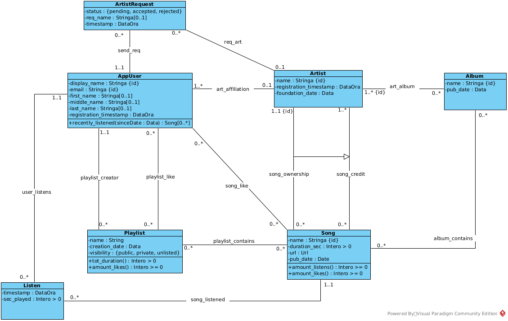
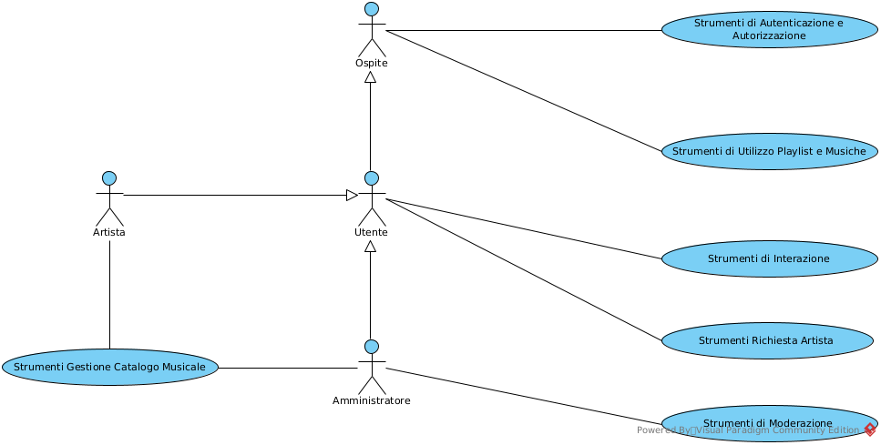

<!-- TOC start (generated with https://github.com/derlin/bitdowntoc) -->

- [Analisi Concettuale dei Requisiti](#analisi-concettuale-dei-requisiti)
   * [Diagramma delle Classi (Class Diagram)](#diagramma-delle-classi-class-diagram)
   * [Specifica dei tipi di dato](#specifica-dei-tipi-di-dato)
   * [Vincoli Esterni](#vincoli-esterni)
      + [[V.Artist.registrato_dopo_fondazione] Un Artista può registrarsi solo dopo la sua data di fondazione](#vartistregistrato_dopo_fondazione-un-artista-può-registrarsi-solo-dopo-la-sua-data-di-fondazione)
      + [[V.art_album.pubblicazione_dopo_fondazione] Un Artista non può pubblicare un Album se non è stato fondato](#vart_albumpubblicazione_dopo_fondazione-un-artista-non-può-pubblicare-un-album-se-non-è-stato-fondato)
      + [[V.song_credit.pubblicazione_dopo_fondazione] Un Artista non può pubblicare una Canzone se non è stato fondato](#vsong_creditpubblicazione_dopo_fondazione-un-artista-non-può-pubblicare-una-canzone-se-non-è-stato-fondato)
      + [[V.Listen.data_di_ascolto_valida] Un Ascolto deve esser fatto dopo la registrazione di un Utente e dopo la pubblicazione di una Canzone](#vlistendata_di_ascolto_valida-un-ascolto-deve-esser-fatto-dopo-la-registrazione-di-un-utente-e-dopo-la-pubblicazione-di-una-canzone)
      + [[V.Listen.non_ascolta_piu_della_durata] Un Utente non può Ascoltare per una durata superiore alla durata della Canzone stessa](#vlistennon_ascolta_piu_della_durata-un-utente-non-può-ascoltare-per-una-durata-superiore-alla-durata-della-canzone-stessa)
      + [[V.ArtistRequest.tipo_richiesta_esclusivo] Una Richiesta deve indicare il nome per un nuovo Artista oppure riferirsi a un Artista già esistente, ma non entrambe o nessuna delle due.](#vartistrequesttipo_richiesta_esclusivo-una-richiesta-deve-indicare-il-nome-per-un-nuovo-artista-oppure-riferirsi-a-un-artista-già-esistente-ma-non-entrambe-o-nessuna-delle-due)
      + [[V.ArtistRequest.richiesta_dopo_registrazione_ut] Un Utente non può Richiedere di diventare un Artista prima della sua registrazione](#vartistrequestrichiesta_dopo_registrazione_ut-un-utente-non-può-richiedere-di-diventare-un-artista-prima-della-sua-registrazione)
      + [[V.ArtistRequest.richiesta_dopo_registrazione_art] Una Richiesta non può riguardare un Artista che si è registrato dopo la Richiesta stessa](#vartistrequestrichiesta_dopo_registrazione_art-una-richiesta-non-può-riguardare-un-artista-che-si-è-registrato-dopo-la-richiesta-stessa)
   * [Specifica delle Classi](#specifica-delle-classi)
      + [Specifica della classe AppUser](#specifica-della-classe-appuser)
      + [Specifica della classe Playlist](#specifica-della-classe-playlist)
      + [Specifica della classe Song](#specifica-della-classe-song)
   * [Diagramma degli Use-Case](#diagramma-degli-use-case)
   * [Specifica degli Use-Case](#specifica-degli-use-case)
      + [Use-Case X](#use-case-x)
      + [Use-Case Y](#use-case-y)
      + [Use-Case Z](#use-case-z)

<!-- TOC end -->

<!-- TOC -->
# Analisi Concettuale dei Requisiti

<!-- TOC -->
## Diagramma delle Classi (Class Diagram)

<!-- TOC -->
## Specifica dei tipi di dato

- Url: Stringa che rappresenta un URL http o https secondo la sintassi RFC 3986

<!-- TOC -->
## Vincoli Esterni

<!-- TOC -->
### [V.Artist.registrato_dopo_fondazione] Un Artista può registrarsi solo dopo la sua data di fondazione

Per ogni _a:Artist_ deve essere vero che a.foundation_date < a.registration_timestamp

<!-- TOC -->
### [V.art_album.pubblicazione_dopo_fondazione] Un Artista non può pubblicare un Album se non è stato fondato

Per ogni _art:Artist_ e _alb:Album_, tali che _(art, alb):art_album_, deve essere vero che art.foundation_date < alb.pub_date

<!-- TOC -->
### [V.song_credit.pubblicazione_dopo_fondazione] Un Artista non può pubblicare una Canzone se non è stato fondato

Per ogni _a:Artist_ e _s:Song_, tali che _(a, s):song_credit_, deve essere vero che a.foundation_date <= s.pub_date

<!-- TOC -->
### [V.Listen.data_di_ascolto_valida] Un Ascolto deve esser fatto dopo la registrazione di un Utente e dopo la pubblicazione di una Canzone

Per ogni _u:AppUser_, _l:Listen_ e _s:Song_, tali che _(u, l):user_listens_ e che _(s, l):song_listened_, devono essere vere entrambe le condizioni:
- s.pub_date <= l.timestamp
- u.registration_timestamp <= l.timestamp

<!-- TOC -->
### [V.Listen.non_ascolta_piu_della_durata] Un Utente non può Ascoltare per una durata superiore alla durata della Canzone stessa

Per ogni _l:Listen_ e _s:Song_, tali _(s, l):song_listened_, deve essere vero che l.sec_played <= s.duration_sec

<!-- TOC -->
### [V.ArtistRequest.tipo_richiesta_esclusivo] Una Richiesta deve indicare il nome per un nuovo Artista oppure riferirsi a un Artista già esistente, ma non entrambe o nessuna delle due.

Per ogni _r:ArtistRequest_, deve essere vera esattamente una e una sola (**xor**) delle due seguenti condizioni:
- Esiste un valore per l'attributo r.req_name e, contemporaneamente, un valore per l'attributo r.req_foundation_date
- Esiste un _a:Artist_, tale che esista il link _(r, a):req_art_

<!-- TOC -->
### [V.ArtistRequest.richiesta_dopo_registrazione_ut] Un Utente non può Richiedere di diventare un Artista prima della sua registrazione

Per ogni _r:ArtistRequest_ e _u:AppUser_, tali che esista il link _(r, u):send_req_ deve essere vero che u.registration_timestamp < r.timestamp

<!-- TOC -->
### [V.ArtistRequest.richiesta_dopo_registrazione_art] Una Richiesta non può riguardare un Artista che si è registrato dopo la Richiesta stessa

Per ogni _r:ArtistRequest_ e _a:Artist, tali che esista il link _(r, a):req_art_ deve essere vero che a.registration_timestamp < r.timestamp

<!-- TOC -->
## Specifica delle Classi

<!-- TOC -->
### Specifica della classe AppUser

recently_listened(sinceDate : Data): Song[0..*] 
Pre: Deve essere vero che sinceDate < Oggi 
Post: L'operazione non modifica i dati. Il risultato è così definito:

- Sia _L_ l'iniseme di tutti i l:Listen tali che esiste il link (this, l):user_listens e per i quali sia vero che **sinceDate** < l.timestamp
- result è l'iniseme di tutte le s:Song, tali che esiste il link (l, s):song_listened, per almeno un oggetto l appartenente all'insieme _L_

<!-- TOC -->
### Specifica della classe Playlist

tot_duration(): Intero > 0 
Pre: Nessuna 
Post: L'operazione non modifica i dati. Il risultato è così definito:

- Sia S l'insieme di tutte le _s:Song_, tali che esiste il link (this, s):playlist_contains
- result è la somma di tutte le s.duration_sec in S, espresso in ore, minuti e secondi

amount_likes(): Intero > 0 
Pre: Nessuna 
Post: L'operazione non modifica i dati. Il risultato è così definito:

- Sia UserLikes l'insieme di tutti gli u:AppUser, tali che esiste il link (u, this):playlist_like
- result = |UserLikes|

<!-- TOC -->
### Specifica della classe Song

amount_listens(): Intero > 0 
Pre: Nessuna 
Post: L'operazione non modifica i dati. Il risultato è così definito:

- Sia L l'insieme di tutti i _l:Listen_, tali che esista il link (l, this):song_listened
- result = |L|

amount_likes(): Intero > 0 
Pre: Nessuna 
Post: L'operazione non modifica i dati. Il risultato è così definito:

- Sia UserLikes l'insieme di tutti gli u:AppUser, tali che esiste il link (u, this):song_like
- result = |UserLikes|

<!-- TOC -->
## Diagramma degli Use-Case

<!-- TOC -->
## Specifica degli Use-Case

### Strumenti di Autenticazione e Autorizzazione

registra(email: Stringa, disp_name: Stringa, f_name: Stringa[0..1], m_name: Stringa[0..1], l_name: Stringa[0..1]) : AppUser 
Pre:

- Non deve esistere alcun _u:AppUser_ tale che u.email = **email**
- Non deve esistere alcun _u:AppUser_ tale che u.display_name = **disp_name**
- **email** e **disp_name** non devono essere vuoti

Post:

- Viene creato e restituito un nuovo oggetto _res:AppUser_, con valori res.email = **email**, res.display_name = **disp_name**, res.first_name = **f_name**, res.middle_name = **m_name**, res.last_name = **l_name** e res.registration_timestamp = Oggi in questo momento

### Strumenti di Utilizzo Playlist e Musiche

crea_playlist(ut: AppUser, name: Stringa, vis: Stringa) : Playlist 
Pre:

- Il valore di **vis** deve appartenere all'insieme {public, private, unlisted}
- **name** non deve essere vuoto

Post:

- Viene creato e restituito un nuovo oggetto _res:Playlist_, con valori res.name = **name**, res.creation_date = Oggi e res.visibility = **vis**
- Viene creato il link _(**ut**, res):playlist_creator_

aggiungi_brano_a_playlist(ut: AppUser, pl: Playlist, s: Song) 
Pre:

- Deve esistere il link _(**ut**, **pl**):playlist_creator_
- Non deve esistere il link _(**pl**, **s**):playlist_contains_

Post:

- Viene creato il link _(**pl**, **s**):playlist_contains_

### Strumenti di Interazione

registra_ascolto(ut: AppUser, s: Song, sec: Intero) 
Pre:

- Deve essere vero che **sec** >= 0 e **sec** <= **s**.duration_sec

Post:

- Viene creato un nuovo oggetto _l:Listen_, con valori l.timestamp = Oggi in questo momento e l.sec_played = **sec**
- Viene creato il link _(**ut**, l):user_listens_
- Viene creato il link _(**s**, l):song_listened_

like_canzone(ut: AppUser, s: Song) 
Pre:

- Non deve esistere il link _(**ut**, **s**):song_like_

Post:

- Viene creato il link _(**ut**, **s**):song_like_

like_playlist(ut: AppUser, pl: Playlist) 
Pre:

- Non deve esistere il link _(**ut**, **pl**):playlist_like_

Post:

- Viene creato il link _(**ut**, **pl**):playlist_like_

### Use-Case Strumenti Gestione Catalogo Musicale

pubblica_canzone(art_owner: Artist, art_credits: Artist[1..*], song_name: Stringa, duration: Intero >= 0, audio_url: Url): Song 
Pre:

- **art_owner** deve essere incluso nell'insieme degli artisti **art_credits**
- Per ogni _art:Artist_ in **art_credits**, deve essere vero che art.foundation_date <= Oggi
- **song_name** non deve essere vuoto

Post:

- Viene creato e restituito un nuovo oggetto _res:Song_, con valori res.name = **song_name**, res.duration_sec = **duration**, res.url = **audio_url** e res.pub_date = Oggi
- Per ogni _art:Artist_ in **art_credits**, vengono creati i link _(art, res):song_credit_
   - Tra questi, il link _(**art_owner**, res)_ viene specializzato come istanza anche dell'associazione _song_ownership_

pubblica_album(artists: Artist[1..*], songs: Song[0..*], alb_name: Stringa): Album 
Pre:

- **alb_name** non deve essere vuoto

Post:

- Viene creato e restituito un nuovo oggetto _res:Album_, con valori res.name = **alb_name** e res.pub_date = Oggi
- Per ogni _art:Artist_ in **artists**, vengono creati i link _(art, res):art_album_
- Per ogni _s:Song_ in **songs**, vengono creati i link _(res, s):album_contains_

<!-- TOC -->
### Use-Case Strumenti Richiesta Artista

invia_richiesta_nuovo_artista(ut: AppUser, req_name: Stringa, req_foundation_date : Data) : ArtistRequest 
Pre:

- Non deve esistere alcun _r:ArtistRequest_ tale che _(**ut**, r):send_req_ e che (r.status = 'pending' oppure r.status = 'accepted').
- **req_name** non deve essere vuoto
- Deve essere vero che **req_foundation_date** <= Oggi

Post:

- Viene creato e restituito un nuovo oggetto _res:ArtistRequest_, con valori res.status = 'pending', res.req_name = **req_name**, res.req_foundation_date = **req_foundation_date** e  res.timestamp = Oggi in questo momento
- Viene creato il link _(**ut**, res):send_req_

invia_richiesta_artista_esistente(ut: AppUser, art: Artist) : ArtistRequest 
Pre:

- Non deve esistere alcun _r:ArtistRequest_ tale che _(**ut**, r):send_req_ e che (r.status = 'pending' oppure r.status = 'accepted').

Post:

- Viene creato e restituito un nuovo oggetto _res:ArtistRequest_, con valori res.status = 'pending', res.req_name = **req_name** e res.timestamp = Oggi in questo momento
- Viene creato il link _(**ut**, res):send_req_
- Viene creato il link _(res, **art**):req_art_

<!-- TOC -->
### Use-Case Strumenti di Moderazione

valuta_richiesta(req: ArtistRequest, accepted: Booleano) 
Pre:

- Deve essere vero che **req**.status = 'pending'

Post:

- Se il valore di **accepted** è falso, allora **req**.status diventa uguale a 'rejected'
- Se il valore di **accepted** è vero, allora **req**.status diventa uguale a 'accepted'. Inoltre:
   - Sia _u:AppUser_, tale che esista il link _(u, **req**):send_req_
   - Se esiste un _art:Artist_, tale che esista il link _(**req**, art):req_art, viene creato il link _(u, art):art_affiliation_
   - Se non esiste alcun link dell'associazione req_art che coinvolga **req**
      - Viene creato un nuovo oggetto _new_art:Artist_, con valori new_art.name = **req**.req_name, new_art.foundation_date = **req**.req_foundation_date e new_art.registration_timestamp = Oggi in questo momento

# Ristrutturazione

## Diagramma delle Classi Ristrutturato

_Inserisci il diagramma ristrutturato qui_

## Vincoli Ristrutturati

_NB: Solo i nuovi vincoli o quelli che sono cambiati rispetto all'analisi verranno riportati qui. Se un vincolo non è riportato, la sua logica non è cambiata_

## Specifica delle Classi

_NB: Solo le nuove specifiche o quelle che sono cambiati rispetto all'analisi verranno riportati qui. Se una specifica non è riportata, la sua logica non è cambiata_

